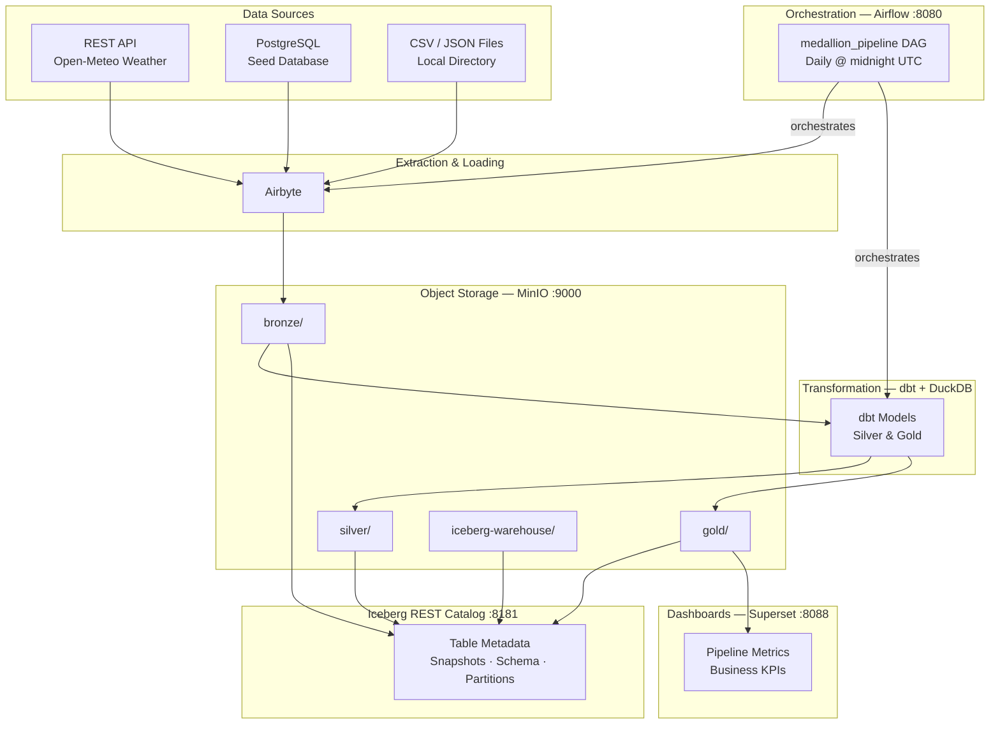

# Modern Batch ELT Pipeline with Medallion Architecture

A fully local, Docker Compose-based data engineering project implementing the **Medallion Architecture** (Bronze → Silver → Gold) using modern open-source tools — zero cloud costs, production-grade patterns.

## Why This Project?

Data engineering interviews and portfolios increasingly expect hands-on experience with data lakehouses, ACID table formats, and orchestrated ELT pipelines. This project gives you a complete, runnable stack that demonstrates:

- **Data Lakehouse patterns** — Apache Iceberg with ACID transactions, schema evolution, and time travel
- **Medallion Architecture** — structured Bronze → Silver → Gold data quality progression
- **Modern ELT tooling** — Airbyte for extraction, dbt for transformation, Airflow for orchestration
- **Observability** — pipeline run tracking, data quality check logging, Superset dashboards

## Architecture



### Data Flow

| Step | Task | Tool | Output |
|------|------|------|--------|
| 1 | Extract & Load | Airbyte | Raw Parquet in `bronze/` |
| 2 | Bronze DQ | dbt source freshness | Row count assertions |
| 3 | Silver Transform | dbt + DuckDB | Cleaned Iceberg tables |
| 4 | Silver DQ | dbt tests | `unique` + `not_null` checks |
| 5 | Gold Transform | dbt + DuckDB | Business aggregates |
| 6 | Gold DQ | dbt tests | Metric column assertions |
| 7 | Log Run | Airflow PythonOperator | `pipeline_runs` Parquet |

## Tech Stack

| Component | Tool | Version |
|-----------|------|---------|
| Object Storage | MinIO | latest |
| Table Format | Apache Iceberg | REST Catalog |
| Ingestion | Airbyte | latest |
| Query Engine | DuckDB | 0.10.0 |
| Transformation | dbt-duckdb | 1.7.0 |
| Orchestration | Apache Airflow | 2.8.0 |
| Dashboards | Apache Superset | latest |
| Database | PostgreSQL | 15 |

## Prerequisites

- **Docker Desktop** (or Docker Engine ≥ 24 + Docker Compose ≥ 2.20)
- **RAM**: 8 GB available for Docker (12 GB recommended)
- **Disk**: 20 GB free space
- **OS**: macOS, Linux, or Windows with WSL2

## Quick Start

### 1. Clone the repository

```bash
git clone <your-repo-url>
cd batch-elt-medallion-pipeline
```

### 2. Configure environment

```bash
cp .env.example .env
```

Open `.env` and set strong values for:
- `MINIO_ROOT_PASSWORD` — MinIO admin password
- `SUPERSET_SECRET_KEY` — random string for Superset session signing

### 3. Start all services

```bash
docker compose up -d
```

First run downloads images and may take 5–10 minutes. Watch progress with:

```bash
docker compose ps
```

All core services should show `healthy` or `running`.

### 4. Seed the database

The PostgreSQL seed database is populated automatically on first start via `scripts/seed-data.sql`. To verify:

```bash
docker exec postgres psql -U postgres -d seed_db -c "SELECT COUNT(*) FROM orders;"
```

### 5. Run the pipeline

Trigger the DAG manually from the Airflow UI or via CLI:

```bash
docker exec airflow-webserver airflow dags trigger medallion_pipeline
```

Monitor progress at http://localhost:8080.

### 6. Explore the data

```bash
# Run dbt Silver transformations
docker exec dbt dbt run --select silver

# Run dbt Gold aggregations
docker exec dbt dbt run --select gold

# Run all dbt tests
docker exec dbt dbt test
```

## Accessing the UIs

| Service | URL | Default Credentials |
|---------|-----|---------------------|
| MinIO Console | http://localhost:9001 | `admin` / `<MINIO_ROOT_PASSWORD>` |
| Airbyte | http://localhost:8000 | — |
| Airflow | http://localhost:8080 | `admin` / `admin` |
| Superset | http://localhost:8088 | `admin` / `admin` |
| Iceberg Catalog | http://localhost:8181/v1/config | — |

## Repository Structure

```
.
├── connections/          # Airbyte source/destination configs (YAML)
├── dags/                 # Airflow DAG definitions
│   └── medallion_pipeline.py
├── data/                 # Sample CSV/JSON source files
├── dbt/                  # dbt project
│   ├── models/
│   │   ├── bronze/       # Source definitions
│   │   ├── silver/       # Cleaning & standardization models
│   │   └── gold/         # Business aggregation models
│   ├── macros/           # Reusable dbt macros
│   └── tests/            # Custom dbt data tests
├── docker/
│   └── dbt/Dockerfile    # Custom dbt runner image
├── docs/                 # Runbooks and architecture docs
├── scripts/              # DB init and seed scripts
├── superset/             # Dashboard JSON exports
└── docker-compose.yml
```

## Learning Milestones

This project is structured as a series of milestones. See [docs/milestones.md](docs/milestones.md) for full details with completion criteria.

| Milestone | Focus |
|-----------|-------|
| 1 — Infrastructure | Docker Compose, MinIO, Iceberg Catalog |
| 2 — Bronze Ingestion | Airbyte connectors, raw data landing |
| 3 — Silver Layer | dbt transformations, data quality |
| 4 — Gold Layer | Business aggregations, incremental models |
| 5 — Orchestration | Airflow DAG, end-to-end pipeline |
| 6 — Dashboards | Superset charts, pipeline observability |
| 7 — Advanced Features | Schema evolution, time travel, idempotency |

## Demo Materials

- [Blog Post](docs/blog-post.md) — design decisions, tradeoffs, and key learnings from building this pipeline
- [Screenshot Guide](docs/demo-guide.md) — step-by-step instructions for capturing screenshots of all four UIs
- [Video Script](docs/demo-video-script.md) — storyboard and script for recording an end-to-end demo video
- `docs/screenshots/` — place captured screenshots here (see demo guide for naming conventions)

## Documentation

- [Architecture Details](docs/architecture.md) — component design, data models, interfaces
- [Learning Milestones](docs/milestones.md) — structured learning path with validation steps
- [Airflow Configuration](docs/airflow-configuration.md) — Airbyte connection setup
- [Superset Setup](docs/superset-setup.md) — dashboard configuration
- [Schema Evolution Guide](docs/schema-evolution.md) — adding columns without rewriting data
- [Time Travel Guide](docs/time-travel.md) — querying historical snapshots
- [Observability Guide](docs/observability.md) — logging, monitoring, debugging

## Cleanup

Stop all services and remove all data volumes:

```bash
docker compose down -v
```

Remove downloaded Docker images:

```bash
docker compose down -v --rmi all
```

## Troubleshooting

**Services not starting / unhealthy**
```bash
docker compose logs <service-name>
# e.g.: docker compose logs iceberg-rest
```

**MinIO buckets missing**
```bash
docker compose restart minio_init
```

**dbt can't connect to MinIO**
- Verify `MINIO_ROOT_USER` and `MINIO_ROOT_PASSWORD` are set in `.env`
- Ensure MinIO is healthy: `docker compose ps minio`

**Airflow DAG not visible**
- DAGs auto-load from `dags/` — wait ~30 seconds after startup
- Check for parse errors: `docker compose logs airflow-scheduler`

**Out of disk space**
```bash
docker system prune -f
docker compose down -v
```

## License

MIT — free to use for learning and portfolio purposes.
