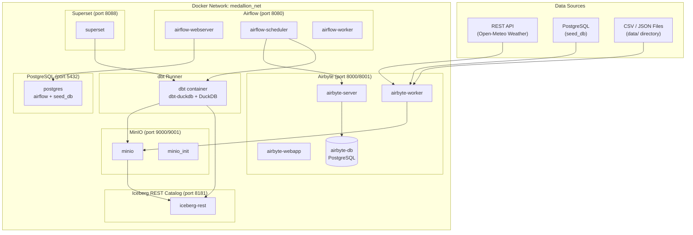
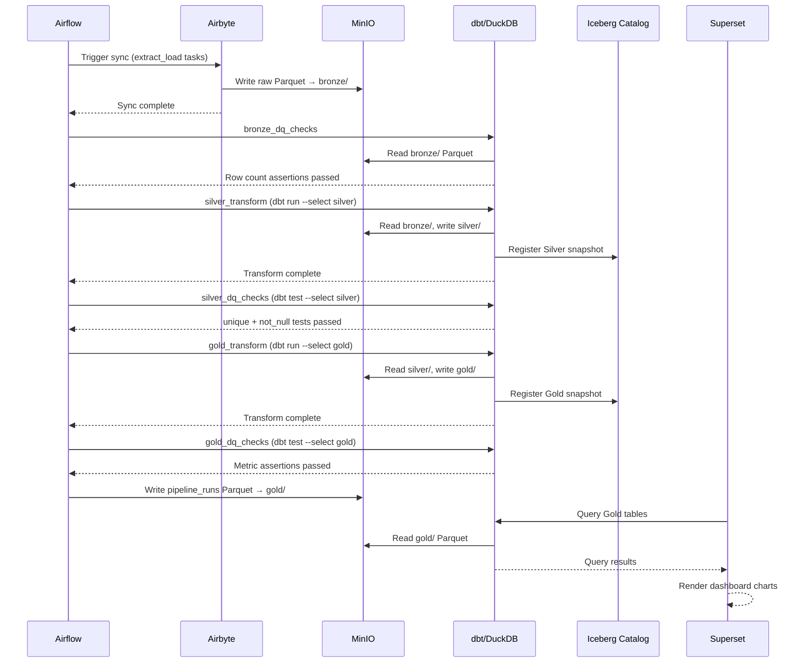

# Architecture: Batch ELT Medallion Pipeline

## Overview

This system is a fully local, Docker Compose-based data lakehouse implementing the **Medallion Architecture**. All components run as Docker containers on a single machine, communicating over a shared Docker network (`medallion_net`). There are no cloud dependencies.

The pipeline follows an **ELT** (Extract-Load-Transform) pattern:
1. **Extract & Load** — Airbyte pulls raw data from sources and writes it to MinIO (Bronze layer)
2. **Transform** — dbt + DuckDB reads Bronze, writes Silver, then reads Silver and writes Gold
3. **Serve** — Superset queries Gold tables for dashboards

---

## Component Architecture



---

## Data Flow



---

## Components

### MinIO — Object Storage

**Purpose**: S3-compatible object storage backend for all data layers and Iceberg metadata.

**Ports**: `9000` (S3 API), `9001` (Console UI)

**Buckets**:
| Bucket | Contents |
|--------|----------|
| `bronze` | Raw Parquet files from Airbyte |
| `silver` | Cleaned Parquet files from dbt |
| `gold` | Aggregated Parquet files from dbt |
| `iceberg-warehouse` | Iceberg table metadata (manifests, snapshots) |

**Initialization**: The `minio_init` sidecar container runs `mc mb` to create all four buckets on first startup, skipping creation if they already exist.

**Access**: All containers reach MinIO at `http://minio:9000` using the S3 API. Credentials are set via `MINIO_ROOT_USER` / `MINIO_ROOT_PASSWORD` in `.env`.

---

### Apache Iceberg REST Catalog

**Purpose**: Centralized metadata store for all Iceberg tables. Tracks table schemas, partition specs, snapshots, and data file locations.

**Port**: `8181`

**Namespaces**: `bronze`, `silver`, `gold`

**Key capabilities**:
- **Schema evolution** — add columns without rewriting Parquet files
- **Time travel** — query any prior snapshot by ID or timestamp
- **ACID transactions** — optimistic concurrency control on writes
- **Snapshot isolation** — reads see a consistent view during concurrent writes

**Storage backend**: Iceberg metadata files (JSON manifests) are stored in `s3://iceberg-warehouse/` on MinIO.

---

### Airbyte — Data Ingestion

**Purpose**: Extract data from multiple source types and load raw records into the Bronze layer.

**Ports**: `8000` (UI), `8001` (API)

**Source connectors**:
| Connector | Source | Sync Mode |
|-----------|--------|-----------|
| `source-http` | Open-Meteo Weather API | Full refresh |
| `source-postgres` | PostgreSQL `seed_db` | Incremental (cursor: `updated_at`) |
| `source-file` | CSV/JSON files in `data/` | Full refresh |

**Destination**: S3 (MinIO) — writes Parquet files to `s3://bronze/{source}/{stream}/`.

**Connection configs**: Stored as YAML in `connections/` for reproducibility.

---

### DuckDB — Query Engine

**Purpose**: Embedded analytics engine used by dbt to read and write Parquet files on MinIO.

**Integration**: Runs in-process inside the `dbt` container — no separate service.

**Extensions loaded**:
- `iceberg` — read/write Iceberg tables
- `httpfs` — access S3-compatible storage

**S3 configuration** (set via `init_iceberg()` macro):
```sql
SET s3_endpoint='minio:9000';
SET s3_use_ssl=false;
SET s3_url_style='path';
```

**Note**: DuckDB 0.10.0 does not support Iceberg REST catalog secrets. Models read directly from S3 Parquet paths using `read_parquet('s3://bronze/...')` rather than through the catalog.

---

### dbt — Transformation Framework

**Purpose**: Define, test, and document all SQL transformations from Bronze → Silver → Gold.

**Adapter**: `dbt-duckdb` 1.7.0

**Project structure**:
```
dbt/
├── dbt_project.yml       # Project config, materializations per layer
├── profiles.yml          # DuckDB connection with S3 settings
├── models/
│   ├── bronze/sources.yml  # Source definitions pointing to S3 paths
│   ├── silver/             # Cleaning models + schema tests
│   └── gold/               # Aggregation models + schema tests
├── macros/
│   ├── init_iceberg.sql          # Loads extensions, configures S3
│   ├── non_negative_value.sql    # Custom test: value >= 0
│   ├── positive_value.sql        # Custom test: value > 0
│   └── row_count_greater_than_zero.sql  # Custom test: table not empty
└── tests/
    └── aggregate_totals_validation.sql
```

**Materializations**:
| Layer | Materialization | Unique Key |
|-------|----------------|------------|
| Silver | `incremental` | source primary key |
| Gold | `incremental` | date or customer_id |
| Observability | `table` | — |

---

### Apache Airflow — Orchestration

**Purpose**: Schedule and monitor the full pipeline DAG with dependency management and retry logic.

**Port**: `8080`

**Executor**: `LocalExecutor` (single-machine, no Celery/Redis needed)

**DAG**: `medallion_pipeline` — runs daily at midnight UTC

**Task dependency chain**:
```
extract_weather_api ─┐
extract_postgres_db  ├─► bronze_dq_checks ─► silver_transform ─► silver_dq_checks
extract_csv_files   ─┘                                                    │
                                                                          ▼
                                                              gold_transform ─► gold_dq_checks ─► log_pipeline_run
```

**Retry policy**: 2 retries with 5-minute delay per task.

**Failure behavior**: If any task fails, downstream tasks are skipped for that run. `log_pipeline_run` uses `trigger_rule='all_done'` so it always records the run outcome.

---

### Apache Superset — Dashboards

**Purpose**: Business intelligence layer connected to Gold tables.

**Port**: `8088`

**Dashboards**:
- **Pipeline Metrics** — DAG run history, row counts per layer, DQ pass/fail history
- **Business KPIs** — daily weather trends, order metrics, customer lifetime value

**Connection**: Superset connects to DuckDB via SQLAlchemy to query Gold Parquet files on MinIO.

---

## Medallion Architecture Layers

### Bronze — Raw Landing Zone

**Goal**: Preserve source data exactly as received. Never transform, filter, or rename fields.

**Metadata columns added to every record**:
| Column | Type | Description |
|--------|------|-------------|
| `_source_name` | STRING | Airbyte connector name |
| `_ingested_at` | TIMESTAMP | Sync timestamp |
| `_file_path` | STRING | S3 path to source file |
| `_has_null_key` | BOOLEAN | True if source primary key is null |

**Partitioning**: By `DATE(_ingested_at)` for efficient time-range queries.

**Retention**: Append-only — new syncs add records, never overwrite.

---

### Silver — Cleaned & Standardized

**Goal**: Reliable, typed, deduplicated data ready for analytics.

**Transformations applied**:
1. **Type casting** — strings → proper types (DATE, DOUBLE, etc.)
2. **Deduplication** — keep latest record per primary key by `_ingested_at`
3. **Null handling** — empty strings → SQL NULL
4. **String trimming** — all strings trimmed and UTF-8 encoded
5. **ISO 8601 timestamps** — all dates standardized to `YYYY-MM-DD`

**Additional metadata**:
| Column | Description |
|--------|-------------|
| `_silver_processed_at` | Timestamp when record entered Silver |

**dbt tests enforced**: `unique` + `not_null` on all primary keys.

---

### Gold — Business Aggregates

**Goal**: Pre-aggregated, business-ready datasets optimized for dashboard queries.

**Models**:
| Model | Grain | Key Metrics |
|-------|-------|-------------|
| `order_metrics` | Daily | total orders, revenue, avg order value, unique customers |
| `customer_lifetime_value` | Per customer | total spent, order count, days since last order |
| `pipeline_runs` | Per DAG run | status, duration, row counts per layer |
| `dq_results` | Per DQ check | check name, layer, status, error message |

**Incremental processing**: Only Silver records newer than the last Gold run are aggregated, avoiding full table scans.

**dbt tests enforced**: `not_null` + `non_negative_value` on all metric columns, `row_count_greater_than_zero` on business models.

---

## Data Models

### Bronze Tables

```sql
-- weather_data
location        STRING,
date            STRING,          -- raw string from source
temperature     STRING,          -- raw string from source
humidity        STRING,
condition       STRING,
_source_name    STRING,
_ingested_at    TIMESTAMP,
_file_path      STRING,
_has_null_key   BOOLEAN
-- Partitioned by DATE(_ingested_at)

-- orders
order_id        STRING,
customer_id     STRING,
order_date      STRING,
order_amount    STRING,
status          STRING,
_source_name    STRING,
_ingested_at    TIMESTAMP,
_file_path      STRING,
_has_null_key   BOOLEAN

-- customers
customer_id     STRING,
customer_name   STRING,
email           STRING,
signup_date     STRING,
country         STRING,
_source_name    STRING,
_ingested_at    TIMESTAMP,
_file_path      STRING,
_has_null_key   BOOLEAN
```

### Silver Tables

```sql
-- weather_clean
location            STRING NOT NULL,
date                DATE NOT NULL,
temperature_celsius DOUBLE,
humidity_percent    DOUBLE,
condition           STRING,          -- NULL if empty
_ingested_at        TIMESTAMP NOT NULL,
_silver_processed_at TIMESTAMP NOT NULL,
location_date       STRING NOT NULL  -- composite PK: location + date

-- orders_clean
order_id            STRING NOT NULL,  -- PK
customer_id         STRING NOT NULL,
order_date          DATE NOT NULL,
order_amount        DOUBLE NOT NULL,
status              STRING,           -- NULL if empty
_ingested_at        TIMESTAMP NOT NULL,
_silver_processed_at TIMESTAMP NOT NULL

-- customers_clean
customer_id         STRING NOT NULL,  -- PK
customer_name       STRING NOT NULL,
email               STRING,           -- lowercased, NULL if empty
signup_date         DATE NOT NULL,
country             STRING,           -- NULL if empty
_ingested_at        TIMESTAMP NOT NULL,
_silver_processed_at TIMESTAMP NOT NULL
```

### Gold Tables

```sql
-- order_metrics (daily grain)
order_date          DATE NOT NULL,    -- PK
total_orders        INTEGER NOT NULL,
total_revenue       DOUBLE NOT NULL,
avg_order_value     DOUBLE NOT NULL,
unique_customers    INTEGER NOT NULL,
_gold_updated_at    TIMESTAMP NOT NULL

-- customer_lifetime_value (per customer)
customer_id         STRING NOT NULL,  -- PK
customer_name       STRING NOT NULL,
email               STRING,
signup_date         DATE NOT NULL,
country             STRING,
first_order_date    DATE NOT NULL,
last_order_date     DATE NOT NULL,
total_orders        INTEGER NOT NULL,
total_spent         DOUBLE NOT NULL,
avg_order_value     DOUBLE NOT NULL,
days_since_last_order INTEGER,
_gold_updated_at    TIMESTAMP NOT NULL

-- pipeline_runs (observability)
dag_run_id          STRING,
start_time          TIMESTAMP,
end_time            TIMESTAMP,
status              STRING,           -- success | failed | running
bronze_row_count    INTEGER,
silver_row_count    INTEGER,
gold_row_count      INTEGER,
duration_seconds    INTEGER

-- dq_results (observability)
check_id            STRING,
check_name          STRING,
layer               STRING,           -- bronze | silver | gold
table_name          STRING,
check_timestamp     TIMESTAMP,
status              STRING,           -- passed | failed
row_count           INTEGER,
error_message       STRING
```

---

## Network and Port Reference

| Service | Internal Host | External Port | Protocol |
|---------|--------------|---------------|----------|
| MinIO S3 API | `minio:9000` | 9000 | HTTP/S3 |
| MinIO Console | `minio:9001` | 9001 | HTTP |
| Iceberg REST Catalog | `iceberg-rest:8181` | 8181 | HTTP/REST |
| PostgreSQL | `postgres:5432` | 5432 | TCP/PostgreSQL |
| Airbyte API | `airbyte-server:8001` | 8001 | HTTP/REST |
| Airbyte UI | `airbyte-webapp:80` | 8000 | HTTP |
| Airflow UI | `airflow-webserver:8080` | 8080 | HTTP |
| Superset UI | `superset:8088` | 8088 | HTTP |
